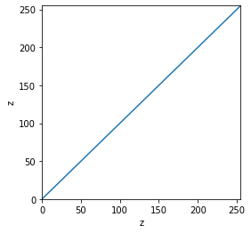
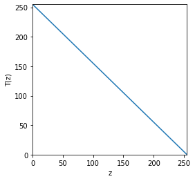
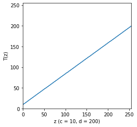

# Procesamiento de Imagenes
## Disciplina: Processamento de Imagens

- Sigla: SCC5830-3/3 
- Créditos: 12 
- Início: 11/03/2020 
- Término: 08/07/2020
- Programação do horário de aulas: Quarta-feira: 10:00 às 13:00

## Servidores

|Servidor | Credenciales                |
|---------|-----------------------------|
| gwin    |    alxs1596@143.107.180.171 |
| eru     |    alxs1596@143.107.180.173 |
| cthulhu |    alxs1596@143.107.180.175 |
| talos   |    alxs1596@143.107.180.176 |
| melkor  |    alxs1596@143.107.180.82  |

Anaconda enviroment: imgproc

## Datos Importantes

### Profesor

- Name: Moacir A. Ponti
- Office: 4-232a
- Hours: Wednesday - 2:00 pm to 4:00 pm
- Email: moacir@icmc.usp.br
  
### Course assistant (PAE)

- Name: Gabriel Cavallari
- Email: gabriel.cavallari@usp.br
- Vinicius Torres M. da Costa
- Email: viniciustdmdacosta@usp.br

### Youtube Playlist

- https://www.youtube.com/playlist?list=PLUKDasxTZfxs2jmVPNPlV2Ba0sNI5fuuf

### Code repository

- https://github.com/maponti/imageprocessing_course_icmc

### Assignments

- http://run.codes (enroll with code AFR9 )

* * *

# Transformations

## Inversion

Invierte la intensidad del pixel

$$ T(z) = 255 - z $$

## Contrast modulation (or adjustment)

Modifica el rango de la imagen (a,b) en un nuevo rango (c,d) donde a,b son el minimo y maximo valor antiguo y c,d el minimo y maximo valor nuevo

$$ T(z) = (z-a)(\frac{d-c}{b-a}) + c $$

